# zadanie 2

\# Zadanie 2 czerwiec 2023, inf.02
\## Konfiguracja mikrotika
1\. Reset routera. System -\> Reset Configuration
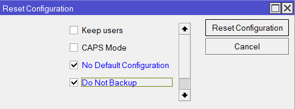
1\. Mostek i Port (Bridge)
Bridge -\> zakładka Bridge -\> + -\> Name: bridge1 -\> OK.
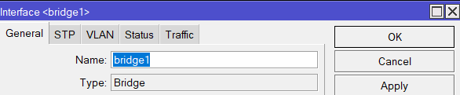
Zakładka Ports -\> + -\> Interface: ether2, Bridge: bridge1 -\> OK.
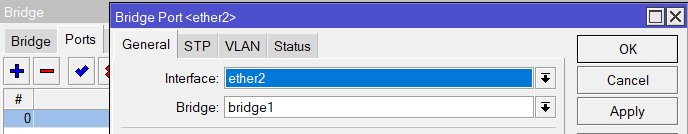
2\. Interfejsy VLAN (Bramy dla sieci)
To tutaj router zaczyna rozumieć sieci:
Interfaces -\> zakładka VLAN -\> +:
Name: vlan1, VLAN ID: 1, Interface: bridge1
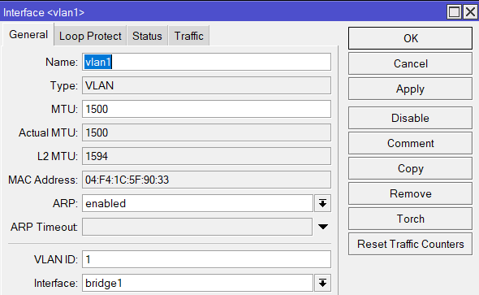
Name: vlan2, VLAN ID: 2, Interface: bridge1
Name: vlan3, VLAN ID: 3, Interface: bridge1
Widok całości:
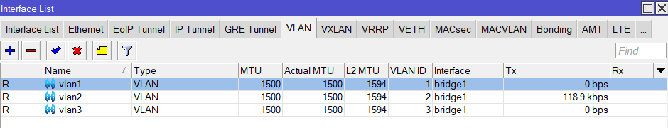
3\. Adresy IP (IP -\> Addresses)
Nadaj routerowi ip/maskę w każdej sieci:
10.27.10.1/24 na vlan1
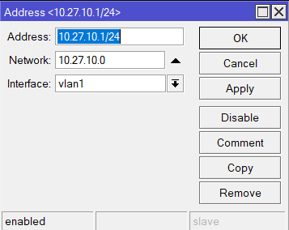
10.27.20.1/24 na vlan2
10.27.30.1/24 na vlan3
Całość:
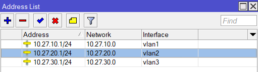
4\. DHCP (Żeby komputer dostał IP)
IP -\> Pool -\> + -\> Name: pool2, Range: 10.27.20.10-10.27.20.15.
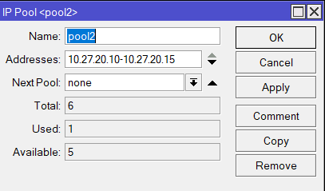
IP -\> DHCP Server -\> DHCP -\> + -\> Name: dhcp2, Interface: vlan2,
Address Pool: pool2.
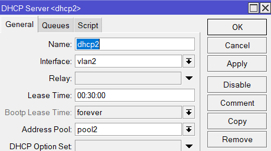
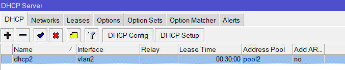
Networks -\> + -\> Address: 10.27.20.0/24, Gateway: 10.27.20.1, DNS:
10.27.30.3.
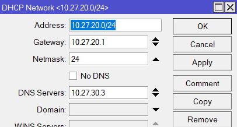
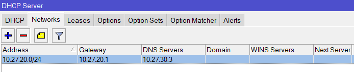
5\. Tagowanie (Bridge -\> VLANs)
Bez tego pakiety nie wyjdą poza router:
Kliknij + -\> VLAN IDs: 1, Tagged: bridge1, ether2 (użyj strzałki w dół,
by dodać drugi).
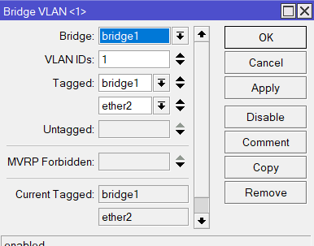
Kliknij + -\> VLAN IDs: 2, Tagged: bridge1, ether2.
Kliknij + -\> VLAN IDs: 3, Tagged: bridge1, ether2.
Całość:
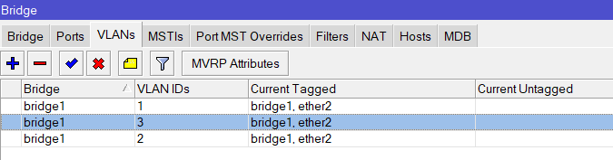
6\. Włączamy filtrowanie:
Bridge -\> zakładka Bridge -\> kliknij dwa razy w bridge1.
Zakładka VLAN -\> zaznacz VLAN Filtering -\> Apply.
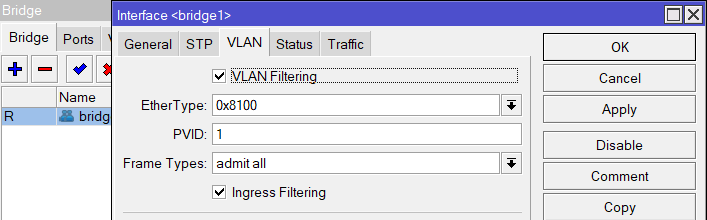
\-\-\-\-\-\-\-\-\-\-\-\-\-\-\-\-\-\-\-\-\-\-\-\-\-\-\-\-\-\-\-\-\-\-\-\-\-\-\-\-\-\-\-\-\-\-\-\-\-\-\-\-\-\-\-\-\-\-\-\-\-\-\-\-\-\-\-\-\-\-\-\-\-\-\-\-\-\-\-\-\-\-\-\-\-\-\-\--
Komunikacja Serwer - Stacja:
Spróbuj pingować bezpośrednio ze stacji (10.27.20.x) na adres serwera
(10.27.30.3). Jeśli to działa, oznacza to, że routing między VLANami
jest OK.
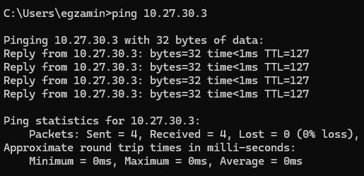
Ping z serwera:
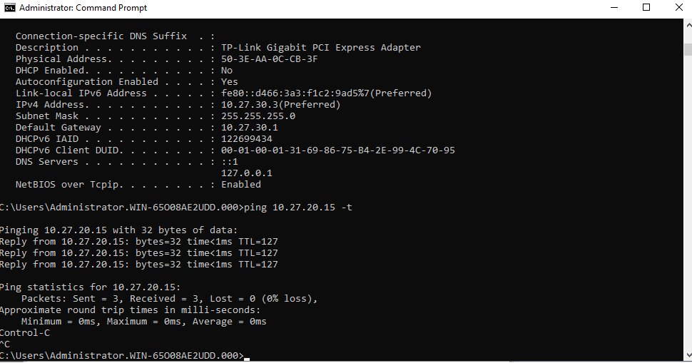
Tablica ARP:
W WinBox wejdź w IP -\> ARP. Powinieneś tam widzieć:
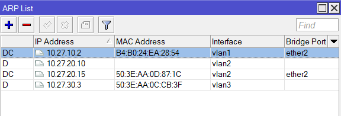
Adres stacji przypisany do interfejsu vlan2.
Adres serwera przypisany do interfejsu vlan3.
Adres switcha przypisany do interfejsu vlan1.
Ustawienia na stacji:
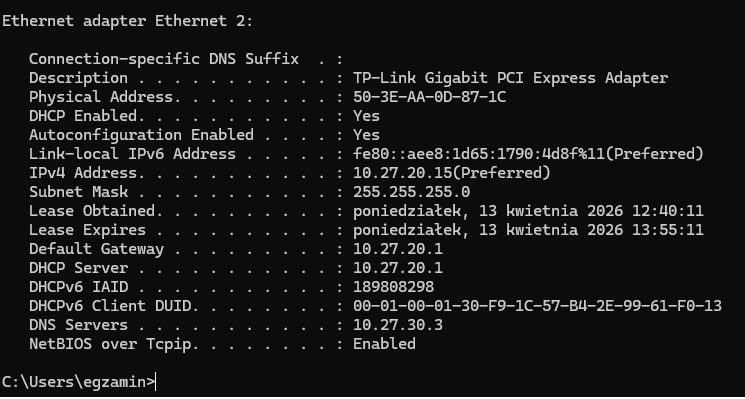
Eksport ustawień:
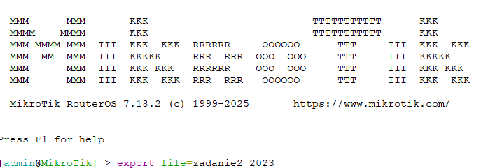
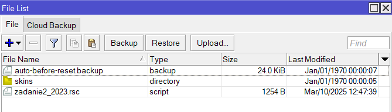
\-\--
Polecenia:

```bash
/interface bridge
add name=bridge1 vlan-filtering=yes
/interface wireless disable \[find\]
set \[ find default-name=wlan1 \] ssid=MikroTik
set \[ find default-name=wlan2 \] ssid=MikroTik
/interface vlan
add interface=bridge1 name=vlan1 vlan-id=1
add interface=bridge1 name=vlan2 vlan-id=2
add interface=bridge1 name=vlan3 vlan-id=3
/interface wireless security-profiles
set \[ find default=yes \] supplicant-identity=MikroTik
/ip pool
add name=pool2 ranges=10.27.20.10-10.27.20.15
/ip dhcp-server
add address-pool=pool2 interface=vlan2 name=dhcp2
/interface bridge port
add bridge=bridge1 interface=ether2
/interface bridge vlan
add bridge=bridge1 tagged=bridge1,ether2 vlan-ids=1
add bridge=bridge1 tagged=bridge1,ether2 vlan-ids=3
add bridge=bridge1 tagged=bridge1,ether2 vlan-ids=2
/ip address
add address=10.27.10.1/24 interface=vlan1 network=10.27.10.0
add address=10.27.20.1/24 interface=vlan2 network=10.27.20.0
add address=10.27.30.1/24 interface=vlan3 network=10.27.30.0
/ip dhcp-server network
add address=10.27.20.0/24 dns-server=10.27.30.3 gateway=10.27.20.1
netmask=24
```

Sprawdzenie:
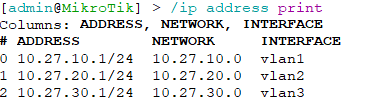
\`\`\`bash
/ip address print
\`\`\`
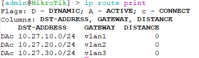
\`\`\`bash
ip route print
\`\`\`
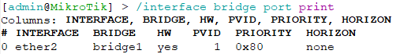
\`\`\`bash
/interface bridge port print
\`\`\`
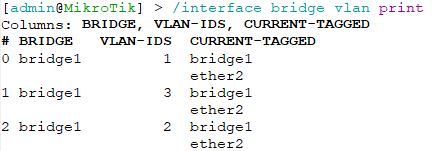
\`\`\`bash
/interface bridge vlan print
\`\`\`
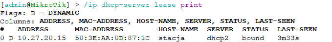
\`\`\`bash
/ip dhcp-server lease print
\`\`\`
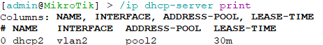
\`\`\`bash
/ip dhcp-server /ping print
\`\`\`
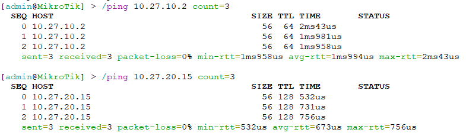
\`\`\`bash
/ping 10.27.10.2 count=3
\`\`\`
\## Konfiguracja switcha
Ustawienie PVID:
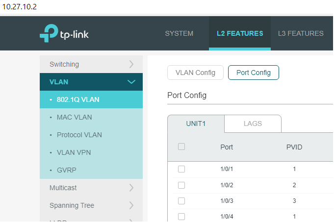
Widok VLAN:
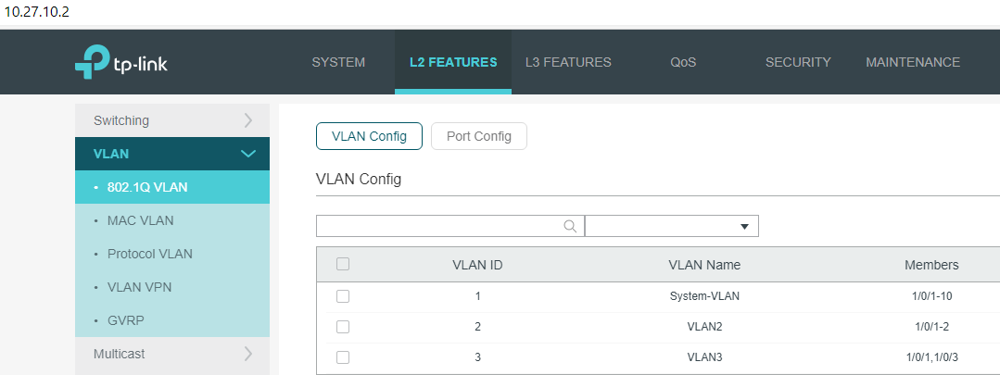
Widok VLAN 3:
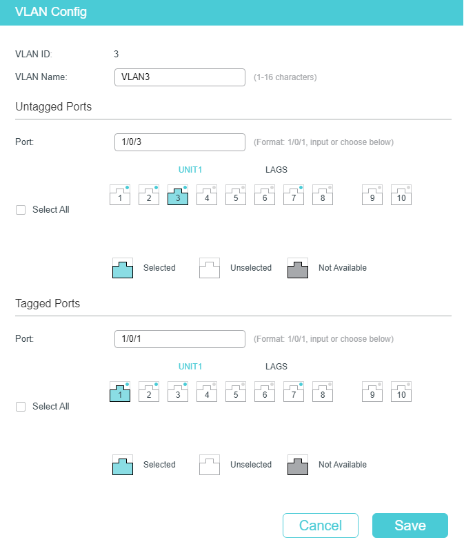
Widok VLAN2:
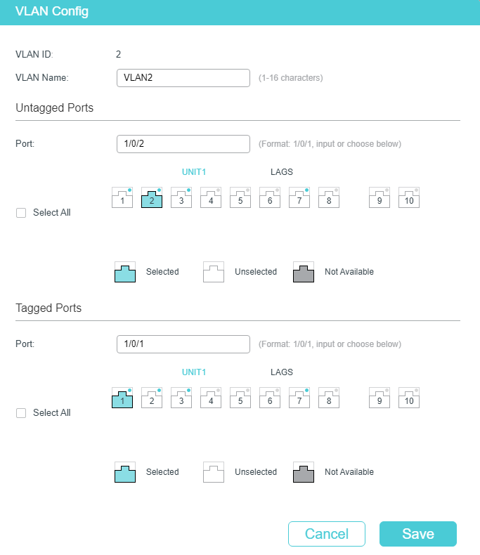
KONIEC.
